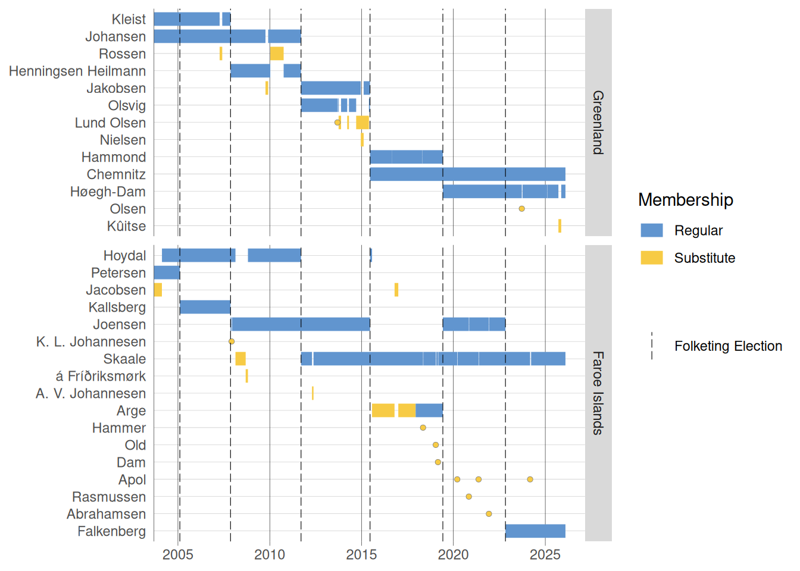

<!-- 8000 -- 10'000 words, 20--25 pages excl. Bibliography -->

<!-- writing: 
- every paragraph includes one argument/thought
- structure of a paragraph: topic sentence, development of the argument (2-3 sentences that elaborate your idea, e.g. by example)
- concluding sentence, link to the next paragraph -->

# Introduction

<!-- Motivation / general topic / relevance -->

- history of memberships @kjaerDanskeFolketingsmedlemmerParlamentarisk2004

parties state they do not want to interfere in 'domestic' Danish politics [@kurrild-klitgaardElectionInversionsCoalitions2013, 130]

they are usually not official members of cabinet, except for Mikael Gam [@skjaevelandMindretalsregeringerDanmarkFor2003]

### DK politics

### Rigsfællesskabet

### Postcolonialism

### Geopolitics on the World Stage

- inner-Rigsfællesskabet debates very current,
  - mechanisms of Rigsfællesskabet dynamics, but within Folketinget?
- opens up international postcolonialism debates
  - "coming down from the ice" [@sjolieDanmarkManglerOpgor2008]
  -  "Greenlandic representatives have been bullied by representatives from Danish parties" [@harderArcticIndigenousRepresentation2024, 141] cf. @cleggParliamentaryRepresentationOverseas2022
- link to general geopolitics focus on Greenland
  + DK using GL/FO (and their FT membership) to legitimize themselves as Arctic state [@westDanishRealmArctic2025, 589]

* Übergreifend hat die Beachtung dieser Abgeordneten zugenommen, seit Grönland aus geopolitischer Sicht in den Fokus gerückt ist, und nicht zuletzt auch Dänemarks Status als Akteur in der Arktis legitimiert werden soll.
Ethnic minority representation (betrifft dann allerdings nur Grönland und nicht die Färöer)
* Dazu kommt noch die ganze post-colonialist-Perspektive ("vi har købt os en grønlænder" etc.).

## Research Questions, Relevant X/Y variables

1. In general, when do the Northatlantic MPs take part in roll call votes?
2. The 2x2 MPs are conceived as one group by DK politicians and media. Do they also vote like one group?
3. When Northatlantic MPs have the chance to have influence, they act on it (based on decades of more or less anecdotal evidence). So, does the seat share of Danish coalition parties influence voting behaviour of Northatlantic MPs?
4. can the Northatlantic MP's voting behavior also be considered a form of cross-parliamentary control?

## Literature Review/Research Gap

<!-- - summary of relevant literature for your research question!
- aim of literature review: identify research gap (and by this your own contribution)
- do not mention every paper written about your case but the most important+related ones
- pathbreaking papers and latest developments should be included
- Direct citations only if absolutely needed, better are paraphrasing -->

Over the past decades, the activity of Folketing MPs from Greenland and the Faroe Islands has been written about time and again -- usually when there are narrow majorities and the 'Northatlantic' votes might become relevant to the voting outcomes, e.g. after elections in 2022, 2015, 2011 or 2007 [@harderFaeroskeOgGronlandske2022; @sorensenEfterBrokBla2022]. While situations like these are regularly reported on by journalists [e.g. @nathanGronlandskMferSer2024; @veirumPartilederePatalerGronlandsk2022; @frostLokkeRaserNordatlantiske2022; @skouKaareFireMandater2008][^zotero], the attention they have received from researchers is marginal at best.

[^zotero]: For a larger collection of reports in mostly Danish-language media from recent years, see my [nordatlantisk-ft Zotero collection](https://www.zotero.org/groups/5346749/nordatlantisk-ft).

If Greenlandic or Faroese political representation in Folketinget does appear in research output, it is often referred to in anecdotes [e.g. "A coalition saved by Greenland", @millerFriendsRivals1996, 80] or in parentheses [e.g. @klintDanishLegislatorsDatabase2023; @elklitElectoralSystemFair2020; @nannestadPolitischeSystemDanemarks2009; @kjaerDanskeFolketingsmedlemmerParlamentarisk2004], acknowledging its existence, but mostly not considering it for analysis implicitly or explicitly [e.g. @ejnarhansenReconsideringPartyDistances2008; @skjaevelandPartyCohesionDanish2001; @valenGeographyPoliticalRepresentation2000; @westPoliticalPartiesParliamentary2025; @elklitDenmarkSimplicityEmbedded2005]. Given the anecdotal evidence about the Northatlantic MPs' presence and the often heated reactions to situations where roll call results are depending on votes from (at least one of) them, it is striking how research related to Folketinget and its dynamics has largely not taken up on this aspect.

In the following paragraphs, I will take a closer look at literature on the functioning of Folketing itself, on coalition and government formation, on the Danish election system as well as on the political parties.

Writing about parliamentary cross-bloc cooperation, @green-pedersenBlokpolitikOgNye2020 [311] do not include political parties from Greenland and the Faroe Islands when counting the number of parties that are represented in parliament at all. Neither does @helboepedersenParliamentFOLKETINGETPowerful2020 in her investigation institutional powers of Folketinget, although she briefly mentions the existence of Northatlantic MPs. @hansenCommitteeAssignmentPolitics2010 states he is not considering these MPs in an analysis of committee assignments. In a categorisation of roll call votes, @skjaevelandPartyCohesionDanish2001 explicitly excludes matters concerning Northatlantic MPs from a category of domestic issues.

The results from a review of literature on coalition and government formation in Denmark are similar: @green-pedersenBlocPoliticsVs2005 and @skjaevelandModellingGovernmentFormation2009 find that gaining government power depends on the median legislator, often centre parties -- which in Denmark has traditionally been associated with Det Radikale Venstre [@green-pedersenDetRadikaleVenstres2003]. Northatlantic MPs are not touched upon in either paper, nor are they mentioned by @christiansenMinorityCoalitionGovernance2014 in their analysis of coalition agreements. @skjaevelandModellingGovernmentFormation2009, however, includes Northatlantic MPs in his research on median parties in Denmark, acknowledging their importance in some coalition life cycles. The take-away from his short digression on the North Atlantic Folketing is that "the more important their votes, the more involved they have become" [-@skjaevelandModellingGovernmentFormation2009, 723]. But even when describing situations where the voting behavior of North Atlantic MPs proved to be decisive for government formations, for some researchers they are still only partially relevant to the distribution of power in Danish politics [@skjaevelandMindretalsregeringerDanmarkFor2003].

With regard to the composition of Folketinget, @kurrild-klitgaardElectionInversionsCoalitions2013 analyses election inversions, meaning the party/political bloc winning the most votes does not end up with the most parliamentary seats after the election -- a situation the Northatlantic MPs have ended up in repeatedly. Using the 1971 election, he demonstrates that the lower cost of winning a Folketinget mandate in the Faroe Islands resulted in a margin so narrow that, if added to continental Danish overall results, would have resulted in an alternative majority [-@kurrild-klitgaardElectionInversionsCoalitions2013, 131]. This is, however, not considered to be a flaw, and the election system of Denmark is regarded to be exceptionally well-functioning [@elklitElectoralSystemFair2020; @lijphartForeword2005], even though that assessment, again, excludes elections in Greenland and the Faroe Islands [cf. @elklitDenmarkSimplicityEmbedded2005]. An otherwise comprehensive database with biographic information on Folketinget legislators by @klintDanishLegislatorsDatabase2023 also does not include anyone from Greenland and the Faroe Islands.

Research on political parties in Denmark, e.g. by @green-pedersenPartySystemOpen2020 or @pedersenPartyDistancesDanish1971, does not cover parties from Greenland or the Faroe Islands either. This is hardly surprising, given that the political parties competing in elections in Denmark, Greenland and the Faroe Islands are separate entities and each party can only be voted for from within either of the three parts of the Danish Realm [@kurrild-klitgaardElectionInversionsCoalitions2013]. Likewise, research on political parties of Greenland and the Faroe Islands features a domestic focus as well [e.g. @ahlnessNunattaQitornaiParty2020; @westSkipanarligarFortreytirOg2022; @michelsenGronlandPartisystemUdvikling1979]. Institutional associations between Greenlandic and Danish parties linked to parliamentary work in Folketinget are mentioned by @ackrenPoliticalPartiesGreenland2015, building on ideologically similar backgrounds of Siumut of Greenland and Socialdemokratiet in Denmark resp. of Atassut (GL) and Venstre (DK). However, Folketinget representation does not seem to be a central issue for regional parties in Greenland and the Faroe Islands. Given that Greenland and the Faroe Islands only hold two seats each, @ackrenExploringRoleRegional2019 deem it unlikely that any Northatlantic proposal would gain enough traction in Folketinget anyway. For these regional parties, the preferred mode of conducting relations with Denmark is by communicating between government officials instead [@ackrenExploringRoleRegional2019].

The inclusion of anything related to the Greenlandic and Faroese representation within the Danish Realm into analyses of the political system of Denmark is not trivial, not least due to the separate party systems and because there are no institutional links between the Northatlantic MPs and neither their national governments nor parliaments [@westDanishRealmArctic2025, 602]. It is likely in this context that the activities of the four Northatlantic MPs feature only in the margins of research on Danish politics. This can be said for research on Folketing and its inner workings specifically, but also for adjacent topics such as research on elections and coalition formations as summarised above.

With this in mind, I assume that the activities of the Greenlandic and Faroese members of Folketinget have mostly been regarded not as a relevant aspect of the political system of Denmark that is worth considering, illustrated by Miller labelling those politicians, i.e. elected members of a legislative assembly, as "non-political" [-@millerFriendsRivals1996, 72][^slesvig]. In conclusion, there has been very little research activity on MPs from Greenland and the Faroe Islands and their behavior in Folketinget compared to the importance that is repeatedly being attributed to their presence. This has, however, changed in recent years with publications explicitly targeting Northatlantic representation in Folketinget: 

[^slesvig]: Miller, referring to the results of the 1957 election, also includes a representative for the German-speaking minority in Southern Slesvig in this group of non-political MPs. However, in this paper I will concentrate on Greenlandic and Faroese MPs only, not considering the representation of other minorities in Folketinget.

@harderFaeroskeOgGronlandske2022
@ackrenExploringRoleRegional2019

@harderCrossparliamentaryControl2025
@staehrharderCaseInnovativeParliamentary2022
@westPoliticalPartiesParliamentary2025
Folketing is a strong institution for controlling the government @helboepedersenParliamentFOLKETINGETPowerful2020

<!-- section Rigsfællesskabet -->
@cleggParliamentaryRepresentationOverseas2022
@harderArcticIndigenousRepresentation2024
@westDanishRealmArctic2025

literature on who is MP?

 - apart from anecdotes [@millerFriendsRivals1996 about Mikael Gam 1960]: behavior "ved vi kun meget lidt om" [@harderFaeroskeOgGronlandske2022, 5; @harderCrossparliamentaryControl2025, 10]. (cf. contribution "with new knowledge concerning the dynamics between the Greenlandic representation in the Danish parliament and the Greenlandic government." [@harderCrossparliamentaryControl2025, 9])

but: recent content by Harder and West, a symptom of increased interest in the Arctic?

-- in light of growing worldwide interest in the High North from a geopolitical perspective as well as considering increased awareness for Denmark's colonialist heritage in the Arctic --  and Rigsfællesskabet dynamics

see also @cleggParliamentaryRepresentationOverseas2022

 - research stating that they do not want to and are also expected to not to interfere

but is there more?

when is it discussed? when is there relevance within DK? -> link to block on research on Rigsfællesskabet

### Rigsfællesskabet

  + "et empirisk hul i rigsfællesskabets historie" [@harderFaeroskeOgGronlandske2022, 6]
  + "opening the 'black box' of the Danish state" [@westDanishRealmArctic2025, 589]

### Overseas Representation, Regional Parties, ethnic minorities?

- national parliaments not in focus of research on "Arctic indigenous peoples' political mobilisation" [@harderArcticIndigenousRepresentation2024, 130]
- beträfe nur GL, nicht FO

### Cross-Parliamentary Control?

### my own contribution

* Forschung zum Folketing klammert die vier nordatlantischen Mandate idR aus, daher sehr wenig Informationen zu ihrem Verhalten/ihrer pol. Arbeit. Ihre Relevanz wird vor allem im Zshg. mit Mehrheitsbeschaffungen attestiert, aber häufig nur anekdotisch bzw. letzten Endes als Kuriosität des politischen Systems in Dänemark behandelt
- link from @harderFaeroskeOgGronlandske2022; @harderCrossparliamentaryControl2025; @harderArcticIndigenousRepresentation2024 and @westPoliticalPartiesParliamentary2025 etc.: new data that has not been considered so far
* Mit meinem Datensatz kann ich die wenigen existierenden Papers, die die Arbeit dieser vier Abgeordneten systematisch bearbeiten, um den Aspekt Abstimmungsverhalten ergänzen.

specifically: GL/FO contributions, more generically: cross-parliamentary control, ethnic representation/Regional parties

#### use of roll call votes as method

# Dataset

# Research Design

## Theoretical Approach

<!-- - case selection/overview data (temporal and spatial), unit of analysis
- measurement dependent variable (and data source)
- measurement independent and control variables (and data source)
- methodological approach (why this one?) -->

  - if they have power, they use it [@harderFaeroskeOgGronlandske2022, 18; @skjaevelandModellingGovernmentFormation2009, 723]
  + relevans efter valg 1971 [@gadGronlandskeFolketingsmedlemmer2022; @kurrild-klitgaardElectionInversionsCoalitions2013, 131; @skjaevelandModellingGovernmentFormation2009, 723], 2007 om asylcentre, but was resolved without GL/FO influence [@gadGronlandskeFolketingsmedlemmer2022; @cleggParliamentaryRepresentationOverseas2022, 239], relevans efter valg 2007, 2011, 2015 [@harderFaeroskeOgGronlandske2022, 19] and 1998 [@skjaevelandModellingGovernmentFormation2009, 723], and 1960 [@skjaevelandGovernmentFormationDenmark2003, 448], and 1957 [@millerFriendsRivals1996, 71]. 2015 not relevant after all? [@arndtFolketingswahlDanemarkVom2019, 785]
  - "I to tilfælde har grønlandsk valgte MFere opnået ministerposten" [@michelsenGronlandPartisystemUdvikling1979, 55] > Gam og hvem?

### Dataset Overview

## Hypotheses

<!-- * Hypothesis: causal relationship between two variables: the more, the less...
* Hypothesis in its own paragraph and in italics -->

## Empirical Strategy

<!-- - variables and controls
- unit of analysis
- method (logit model etc.) -->

- use tredje behandling? cf. @green-pedersenBlokpolitikOgNye2020 [315]

# Results

<!-- - per hypothesis -->

## Implications, Future Research

## Critical Assessment

<!-- * intro&conclusion should speak to each other/mirror each other -->

### Introduction

When the government of Denmark only has a narrow majority in parliament, four MPs regularly come into the spotlight: The so-called North Atlantic MPs -- two from Greenland, two from the Faroe Islands -- who usually abstain from voting on matters not concerning Greenland or the Faroe Islands but might be able provide four sometimes crucial votes to form a majority. In this paper, I am going to investigate what role these four MPs tend to play in Folketing: When do they capitalise on their voting power? Do they actually have as much power as the numbers suggest? Or is their influence rather a media frenzy, highlighting a rather unusual trait of day-to-day domestic politics?

There are 179 MPs in Folketinget, the parliament of Denmark. But only 175 of them are elected in Denmark proper, while the remaining four seats are guaranteed for the so-called North Atlantic MPs from Greenland and the Faroe Islands, which both are autonomous members of the Danish Realm today after being under Danish colonial rule for centuries. Their presence in Folketinget can prove important for domestic Danish politics because not all of the four MPs join one (@fig-timeline) of the two party blocs and can thus provide decisive votes for passing legislation and even for securing the national government's stability [@harderFaeroskeOgGronlandske2022, 19]: Several times, both Danish party blocs found themselves with election results where they did not have what is called a "domestic majority" [_indenrigspolitisk flertal_, @buggeRegeringensIndenrigspolitiskeFlertal2023] but instead relied on the North Atlantic MPs to form a majority of 90 seats -- using the Danish expression: to be able to count to 90. Recently, this was the case in 2016 and 2022[^1] [@sorensenEfterBrokBla2022]: In both instances, opposition parties cried foul and called for re-evaluation of the North Atlantic MPs' roles, who have questioned these arrangements themselves as well [e.g. @skaaleFaeroskMFerNordatlantiske2022; @skaale20sporgsmalUS182021; @joensenLagtingsformandenVilAfskaffe2019], even though they have profited from them -- e.g. by being awarded chairmanship of parliamentary commissions [@harderFaeroskeOgGronlandske2022, 13]. <!-- 2023 situation mit moderaterne hinzufügen! -->

[^1]: Even though the North Atlantic MPs' role was discussed extensively in 2022, it was resolved without the North Atlantic MPs by forming an unusual cross-bloc coalition government.

Just as political relations between Denmark, Greenland and the Faroe Islands are being scrutinised time and again in terms of economy, ecology, security and last but not least postcolonialism, so is the position of two MPs elected to Folketinget in Greenland and the Faroe Islands, respectively.

{#fig-timeline}

* In general, when do the Northatlantic MPs take part in roll call votes? Hypothesis: The MPs are more likely to take part in voting when the issue concerns Greenland/policy areas that GL/FO do not have authority over (e.g. Defense, based on keywords in proposal description and the ministerområde responsible for the proposal, e.g. Forsvarsministeriet, Finansministeriet etc.)
* The 2x2 MPs are conceived as one group by DK politicians and media. Do they also vote like one group? Hypothesis: After excluding absences, similar voting behavior can not be observed across Greenlandic and Faroese MPs, but across the political blocks the MPs belong to (left/right -- in the dataset: usually 2x left from GL, and 1x each from FO, but never multiple MPs from the same party at the same time)
* When Northatlantic MPs have the chance to have influence, they act on it (based on decades of more or less anecdotal evidence). So, does the seat share of Danish coalition parties influence voting behaviour of Northatlantic MPs? Hypothesis: The fewer FT mandates the Danish cabinet coalition parties have themselves, the more likely are GL/FO MPs to cast a vote (regardless of the content of the proposal being voted on)
  * Based on questioning/committee activity analysis of Northatlantic MPs: Cross-parliamentary control mechanisms are especially made use of if the MP's own party is an opposition party in GL/FO. Transferring this finding onto another type of parliamentary activity, can the Northatlantic MP's voting behavior also be considered a form of cross-parliamentary control? Hypothesis: MPs are more likely to engage in parliamentary activity in FT, in this case taking part in voting, if their own party is in opposition in GL/FO.

